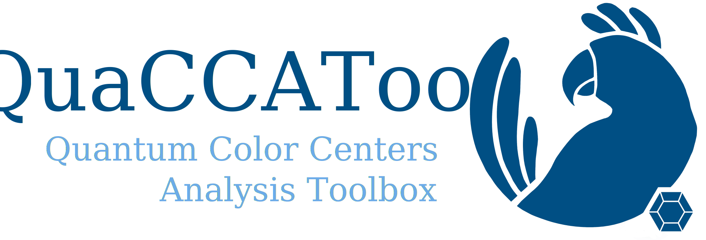

# Quantum Color Centers Analysis Toolbox


QuaCCAToo is a Python software for simulating and analyzing spin dynamics of color centers for quantum technology applications. The software serves as an extension for QuTip, inheriting its object-oriented framework and the Qobj class. This way, the software combines accessibility from the high level of abstraction and human-readability of Python with the efficiency of compiled programming languages as C++, provided by Qutip's parallelization and the matrix algebra from Scipy and Numpy. What unifies color centes and defines the framework of QuaCCAToo is the quantum mechanical description of the magnetic spins with density matrices, combined with a semi-classical description of the control and optical fields. Despite the name, the software then is applicable to a much broader set of physical systems as discussed, as long as the quantum states can be expressed in terms of a density matrix, the system has a well-defined internal Hamiltonian $H_0$ and a control Hamiltonian $H_1$ describing the interaction with external fields.

To see examples of utilization, check the notebooks in the `docs` subdirectory.

To see the documentation, check [https://qiss-hzb.github.io/QuaCCAToo/](https://qiss-hzb.github.io/QuaCCAToo/).

## Installation

We strongly recommend using a virtual environment so that the system Python remains untouched.

You can create a `conda` virtual environment as follows:

```sh
conda create --name quaccatoo-env python
conda activate quaccatoo-env
conda install numpy matplotlib scipy qutip
```
**OR**

You can use a native Python venv (you'll need `pip` as well)

``` sh
python -m venv quaccatoo-env
source quaccatoo-env/bin/activate
```

After the virtual environment has been setup, clone the repository and run (from inside the repo) 

``` sh
pip install .
```

## Class Hierarchy

The package is organized as follows:
- `QSys` defines the quantum system of the problem. It has an obligatory intrinsic internal Hamiltonian $H_0$, optional initial state, observable and a set of collapse operators. On QSys, one can calculate the eigenstates and eigenvalues of the system.


## Contribution guidelines

- To contribute, fork the main branch and make a pull request.
- Properly _document everything_ in details following the `numpy` [docstring format](https://numpydoc.readthedocs.io/en/latest/format.html#docstring-standard).
- Test your branch by running notebooks Ex01 and Ex02. Before making the pull request, _clear the outputs_.
- Use US-English, not British-English. Eg: analyze instead of analyse, color instead of colour, center instead of centre.